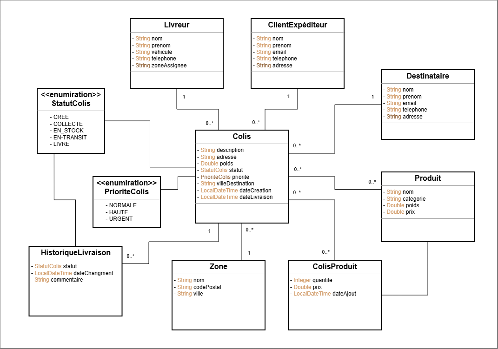

# 📦 DeliGo - Smart Delivery Management System

> Modern logistics management system for SmartLogi - Complete package delivery management across Morocco with JWT authentication and role-based access control

[](https://www.oracle.com/java/)
[](https://spring.io/projects/spring-boot)
[](https://www.postgresql.org/)
[](https://jwt.io/)
[](https://www.docker.com/)

---

## 📖 Overview

**DeliGo** is a comprehensive web application designed to modernize and automate SmartLogi's delivery operations. The system replaces manual Excel-based management with a complete package tracking and traceability solution, featuring enterprise-grade security with JWT authentication and role-based access control.

### Business Context

SmartLogi uses DeliGo to manage the entire logistics cycle:
- Package collection
- Warehouse storage
- Delivery operations
- Real-time package tracking
- Client and delivery personnel management

---

## ✨ Features

### Core Features

#### 📦 Package Management
- Create, track, and update package status
- Multi-criteria filtering (status, priority, zone, delivery person)
- Complete delivery history tracking
- Product management per package
- Overdue package alerts
- Statistical dashboards

#### 👥 User Management
- **Client Senders**: Create delivery requests and track their packages
- **Recipients**: Package destination management
- **Delivery Personnel**: Assignment and route tracking
- Role-based access control (RBAC)

#### 🗺️ Geographic Zones
- Zone organization for delivery optimization
- Automatic delivery personnel assignment by zone
- Coverage area management

#### 🔐 Security Features
- JWT-based stateless authentication
- Three roles: MANAGER, LIVREUR (Delivery), CLIENT
- Fine-grained permission system
- CORS protection
- BCrypt password encryption
- Token expiration management (24 hours)

#### 📊 Analytics & Reports
- Statistics by delivery person
- Statistics by zone
- Package count and total weight
- Performance dashboards
- Search and advanced filtering

#### 🔍 Advanced Search
- Keyword search across multiple fields
- Multi-criteria filtering
- Pagination support
- Sorting options

---

## 🛠️ Technologies

### Backend Stack
- **Java 17** - Programming language
- **Spring Boot 3.5.7** - Application framework
- **Spring Security 6.x** - Authentication & authorization
- **Spring Data JPA** - Data persistence
- **Spring Validation** - Data validation
- **JJWT 0.12.3** - JWT token management
- **PostgreSQL 15** - Relational database
- **Liquibase** - Database migrations
- **MapStruct 1.5.5** - Entity-DTO mapping
- **Lombok** - Boilerplate reduction
- **Maven** - Dependency management

### Documentation & API
- **Swagger/OpenAPI 3** - Interactive API documentation
- **Spring REST** - RESTful API design

### DevOps & Quality
- **Docker** - Containerization
- **Docker Compose** - Multi-container orchestration
- **JaCoCo** - Code coverage (90% target)
- **SonarQube** - Code quality analysis
- **JUnit 5** - Unit testing
- **Mockito** - Mocking framework

---

## 🏗️ Architecture

The project follows **Domain-Driven Design (DDD)** principles with clean architecture:

```
src/main/java/com/shamkhi/deligo/
├── domain/                      # Business Logic Layer
│   ├── security/               # Security domain
│   │   ├── model/             # User, Role, Permission entities
│   │   ├── dto/               # Security DTOs
│   │   ├── repository/        # Security repositories
│   │   └── service/           # Authentication & authorization
│   ├── colis/                 # Package domain
│   │   ├── model/             # Package, History entities
│   │   ├── dto/               # Package DTOs
│   │   ├── repository/        # Package repositories
│   │   └── service/           # Package business logic
│   ├── client/                # Client domain
│   │   ├── model/             # Sender, Recipient entities
│   │   └── service/           # Client management
│   ├── livraison/             # Delivery domain
│   │   ├── model/             # Delivery person, Zone entities
│   │   └── service/           # Delivery management
│   └── produit/               # Product domain
│       └── service/           # Product management
│
├── application/                # Application Layer
│   ├── controller/            # REST Controllers
│   │   ├── AuthController     # Authentication endpoints
│   │   ├── AdminController    # Admin management
│   │   ├── ColisController    # Package endpoints
│   │   └── ...                # Other controllers
│   ├── mapper/                # MapStruct mappers
│   │   ├── SecurityMapper     # Security entity-DTO mapping
│   │   ├── ColisMapper        # Package mapping
│   │   └── ...                # Other mappers
│   ├── security/              # Security configuration
│   │   ├── SecurityConfig     # Spring Security config
│   │   ├── JwtAuthFilter      # JWT validation filter
│   │   └── UserDetailsService # User authentication
│   └── config/                # Application configuration
│       ├── WebConfig          # CORS configuration
│       └── OpenApiConfig      # Swagger configuration
│
└── infrastructure/             # Infrastructure Layer
    └── exception/             # Global exception handling
        ├── GlobalExceptionHandler
        ├── ResourceNotFoundException
        └── DuplicateResourceException
```

### Architectural Patterns

- **Layered Architecture**: Clear separation of concerns
- **Repository Pattern**: Data access abstraction
- **DTO Pattern**: Data transfer objects for API
- **Mapper Pattern**: Entity-DTO conversion with MapStruct
- **Service Layer**: Business logic encapsulation
- **Filter Pattern**: JWT authentication filter

---

## 🔐 Security

### Authentication & Authorization

DeliGo implements enterprise-grade security with JWT (JSON Web Tokens):

#### Authentication Flow
```
1. User logs in with credentials
2. Server validates and generates JWT token
3. Client stores token (localStorage/sessionStorage)
4. Client includes token in Authorization header
5. Server validates token on each request
6. Request processed or rejected based on token validity
```

#### Role-Based Access Control (RBAC)

**ROLE_MANAGER** (Administrator)
- Full system access
- User, delivery personnel, and zone management
- Access to all packages and statistics
- Permission management

**ROLE_LIVREUR** (Delivery Personnel)
- View assigned packages only
- Update status of assigned packages
- No access to other delivery personnel data
- Limited to own delivery operations

**ROLE_CLIENT** (Client Sender)
- Create delivery requests
- View own packages only
- Track package status
- No access to delivery personnel or zones

#### Permission System

Nine fine-grained permissions:
- `READ_COLIS` - View packages
- `WRITE_COLIS` - Create packages
- `UPDATE_COLIS` - Modify packages
- `DELETE_COLIS` - Delete packages
- `UPDATE_STATUT_COLIS` - Change package status
- `MANAGE_LIVREURS` - Manage delivery personnel
- `MANAGE_ZONES` - Manage zones
- `MANAGE_CLIENTS` - Manage clients
- `VIEW_STATISTICS` - Access statistics

#### Security Features

✅ Stateless authentication (JWT)  
✅ BCrypt password encryption  
✅ Token expiration (24 hours)  
✅ CORS protection  
✅ Role-based endpoint protection  
✅ Custom access denied handling  
✅ SQL injection prevention (JPA)  
✅ XSS protection

---

## 🚀 Installation

### Prerequisites

- Java 17 or higher
- Maven 3.8+
- PostgreSQL 15+
- Docker (optional)

### Option 1: Local Installation

#### 1. Clone the repository
```bash
git clone https://github.com/theshamkhi/DeliGo.git
cd DeliGo
```

#### 2. Create the database
```sql
CREATE DATABASE DeliGo;
```

#### 3. Configure application.yaml
```yaml
spring:
  datasource:
    url: jdbc:postgresql://localhost:5432/DeliGo
    username: postgres
    password: your_password

jwt:
  secret: your_secure_secret_key_here_change_in_production
  expiration: 86400000  # 24 hours
```

#### 4. Build and run
```bash
# Clean and install dependencies
mvn clean install

# Run the application
mvn spring-boot:run
```

#### 5. Access the application
- **API Base URL**: http://localhost:8080/api/v1
- **Swagger UI**: http://localhost:8080/api/v1/swagger-ui.html
- **API Docs**: http://localhost:8080/api/v1/api-docs

### Option 2: Docker Installation

#### 1. Using Docker Compose (Recommended)
```bash
# Build and start all services
docker-compose up -d

# View logs
docker-compose logs -f

# Stop services
docker-compose down
```

---

## 📡 API Documentation

### Authentication Endpoints

#### Login
```http
POST /api/v1/auth/login
Content-Type: application/json

{
  "username": "admin",
  "password": "admin123"
}

Response:
{
  "token": "eyJhbGciOiJIUzI1NiJ9...",
  "type": "Bearer",
  "id": "user-admin-001",
  "username": "admin",
  "email": "admin@deligo.com",
  "nom": "Administrateur",
  "prenom": "Système",
  "roles": ["ROLE_MANAGER"],
  "permissions": ["READ_COLIS", "WRITE_COLIS", ...]
}
```

#### Register
```http
POST /api/v1/auth/register
Content-Type: application/json

{
  "username": "john.doe",
  "email": "john@example.com",
  "password": "password123",
  "nom": "Doe",
  "prenom": "John",
  "telephone": "0612345678",
  "roles": ["ROLE_CLIENT"]
}
```

#### Get Current User
```http
GET /api/v1/auth/me
Authorization: Bearer <token>
```

### Package Endpoints (Secured)

All package endpoints require authentication via JWT token in the Authorization header:
```
Authorization: Bearer <your_jwt_token>
```

#### List Packages
```http
GET /api/v1/colis?page=0&size=20&sort=dateCreation,desc
Authorization: Bearer <token>

Response: Paginated list (filtered by role)
- MANAGER: sees all packages
- LIVREUR: sees only assigned packages
- CLIENT: sees only own packages
```

#### Create Package
```http
POST /api/v1/colis
Authorization: Bearer <token>
Content-Type: application/json

{
  "description": "Package description",
  "poids": 2.5,
  "priorite": "NORMALE",
  "clientExpediteurId": "client-123",
  "destinataireId": "dest-456",
  "villeDestination": "Casablanca",
  "dateLimiteLivraison": "2024-12-31T23:59:59"
}
```

#### Update Package Status
```http
PATCH /api/v1/colis/{id}/statut
Authorization: Bearer <token>
Content-Type: application/json

{
  "statut": "EN_COURS",
  "commentaire": "Package picked up",
  "modifiePar": "livreur-789"
}
```

#### Get Package Details
```http
GET /api/v1/colis/{id}
Authorization: Bearer <token>
```

#### Search Packages
```http
GET /api/v1/colis/search?keyword=casablanca&page=0&size=20
Authorization: Bearer <token>
```

#### Filter Packages
```http
GET /api/v1/colis/filter?statut=EN_COURS&priorite=URGENTE&zoneId=zone-123
Authorization: Bearer <token>
```

#### Get Package History
```http
GET /api/v1/colis/{id}/historique
Authorization: Bearer <token>
```

#### Get Statistics
```http
GET /api/v1/colis/statistiques
Authorization: Bearer <token>
Requires: ROLE_MANAGER
```

### Admin Endpoints (ROLE_MANAGER only)

#### User Management
```http
GET    /api/v1/admin/users
POST   /api/v1/admin/users
GET    /api/v1/admin/users/{id}
PUT    /api/v1/admin/users/{id}
DELETE /api/v1/admin/users/{id}
PATCH  /api/v1/admin/users/{id}/activate
PATCH  /api/v1/admin/users/{id}/deactivate
```

#### Permission Management
```http
GET    /api/v1/admin/permissions
POST   /api/v1/admin/permissions
PUT    /api/v1/admin/permissions/{id}
DELETE /api/v1/admin/permissions/{id}
```

#### Role Management
```http
GET    /api/v1/admin/roles
POST   /api/v1/admin/roles
PUT    /api/v1/admin/roles/{id}
DELETE /api/v1/admin/roles/{id}

# Assign/Remove permissions to/from roles
POST   /api/v1/admin/roles/{roleId}/permissions/{permissionId}
DELETE /api/v1/admin/roles/{roleId}/permissions/{permissionId}
GET    /api/v1/admin/roles/{roleId}/permissions
```

### Client & Recipient Endpoints
```http
GET    /api/v1/clients                  # List clients
POST   /api/v1/clients                  # Create client
GET    /api/v1/clients/{id}             # Get client details
PUT    /api/v1/clients/{id}             # Update client
DELETE /api/v1/clients/{id}             # Delete client (MANAGER only)

GET    /api/v1/destinataires            # List recipients
POST   /api/v1/destinataires            # Create recipient
GET    /api/v1/destinataires/{id}       # Get recipient
PUT    /api/v1/destinataires/{id}       # Update recipient
DELETE /api/v1/destinataires/{id}       # Delete recipient (MANAGER only)
```

### Delivery Personnel Endpoints (ROLE_MANAGER only)
```http
GET    /api/v1/livreurs                 # List all delivery personnel
GET    /api/v1/livreurs/actifs          # List active only
POST   /api/v1/livreurs                 # Create delivery person
GET    /api/v1/livreurs/{id}            # Get details
PUT    /api/v1/livreurs/{id}            # Update
DELETE /api/v1/livreurs/{id}            # Delete
```

### Zone & Product Endpoints
```http
GET    /api/v1/zones                    # List zones (MANAGER)
POST   /api/v1/zones                    # Create zone (MANAGER)
GET    /api/v1/zones/{id}               # Get zone (MANAGER)
PUT    /api/v1/zones/{id}               # Update zone (MANAGER)
DELETE /api/v1/zones/{id}               # Delete zone (MANAGER)

GET    /api/v1/produits                 # List products
POST   /api/v1/produits                 # Create product (MANAGER)
GET    /api/v1/produits/{id}            # Get product
PUT    /api/v1/produits/{id}            # Update product (MANAGER)
DELETE /api/v1/produits/{id}            # Delete product (MANAGER)
```

### Package Statuses
- `CREE` - Created
- `EN_STOCK` - In warehouse
- `COLLECTE` - Collected
- `EN_COURS` - In transit
- `LIVRE` - Delivered
- `ANNULE` - Cancelled
- `RETOURNE` - Returned

### Priority Levels
- `NORMALE` - Normal
- `URGENTE` - Urgent
- `TRES_URGENTE` - Very urgent

---

## 📸 Screenshots

### Swagger UI - Interactive API Documentation


*Complete API documentation with authentication support*

### UML Class Diagram


*Entity relationship diagram showing the domain model*

### JaCoCo Code Coverage Report


*Test coverage report - Target: 90%+*

### SonarQube Quality Analysis


*Code quality metrics and technical debt analysis*

---

## 🧪 Testing & Quality

### Code Coverage with JaCoCo

The project maintains **90%+ code coverage** with JaCoCo:

```bash
# Run tests with coverage
mvn clean test

# Generate coverage report
mvn jacoco:report

# View report
open target/site/jacoco/index.html
```

**Coverage Configuration:**
- Minimum line coverage: 60%
- Excluded: Config, DTOs, Models, Generated code

### Code Quality with SonarQube

Integrated with SonarQube for continuous quality analysis:

```bash
# Run SonarQube analysis
mvn clean verify sonar:sonar \
  -Dsonar.projectKey=deligo \
  -Dsonar.host.url=https://sonarcloud.io \
  -Dsonar.login=<your-token>
```

### Running Tests

```bash
# Run all tests
mvn test

# Run specific test class
mvn test -Dtest=ColisServiceTest

# Run tests with coverage
mvn clean verify

# Skip tests
mvn clean install -DskipTests
```

---

## 🐳 Docker Deployment

### Production Deployment

#### Using Docker Compose (Recommended)

**docker-compose.yml:**
```yaml
version: '3.8'

services:
  postgres:
    image: postgres:15-alpine
    container_name: deligo-postgres
    environment:
      POSTGRES_DB: DeliGo
      POSTGRES_USER: postgres
      POSTGRES_PASSWORD: ${POSTGRES_PASSWORD}
    ports:
      - "5432:5432"
    volumes:
      - postgres-data:/var/lib/postgresql/data
    healthcheck:
      test: ["CMD-SHELL", "pg_isready -U postgres"]
      interval: 10s
      timeout: 5s
      retries: 5

  app:
    build: .
    container_name: deligo-app
    depends_on:
      postgres:
        condition: service_healthy
    environment:
      SPRING_DATASOURCE_URL: jdbc:postgresql://postgres:5432/DeliGo
      SPRING_DATASOURCE_USERNAME: postgres
      SPRING_DATASOURCE_PASSWORD: ${POSTGRES_PASSWORD}
      JWT_SECRET: ${JWT_SECRET}
      JWT_EXPIRATION: 86400000
    ports:
      - "8080:8080"
    restart: unless-stopped

volumes:
  postgres-data:
```

---

## 👥 Authors

**Mohammed Shamkhi**
- GitHub: [@theshamkhi](https://github.com/theshamkhi)
- Email: theshamkhi1@gmail.com
